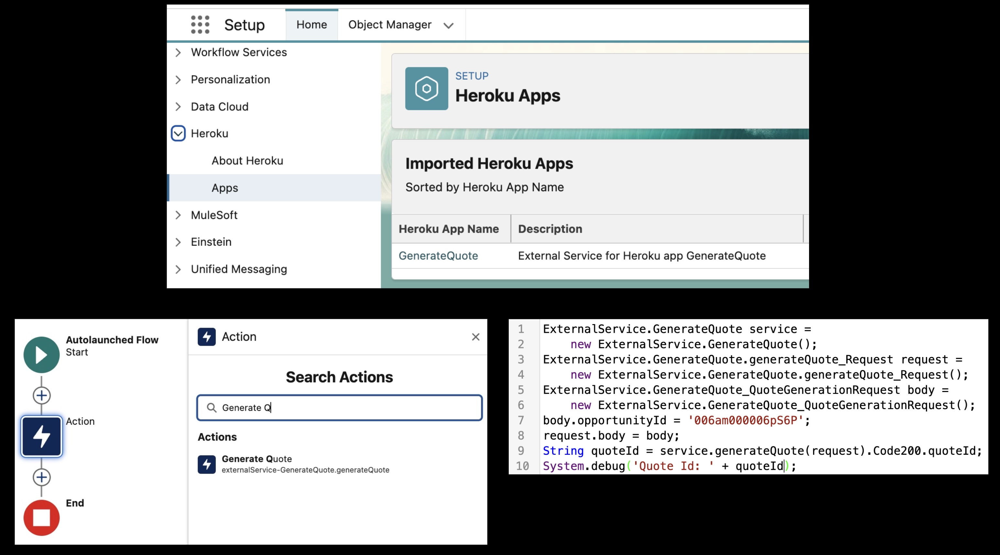
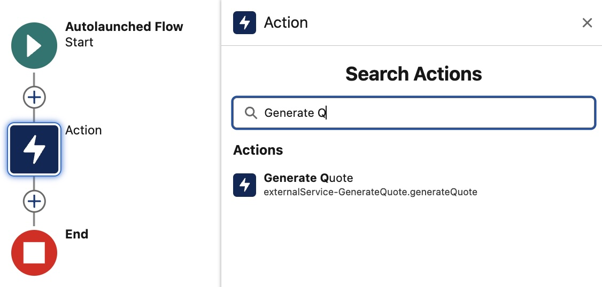
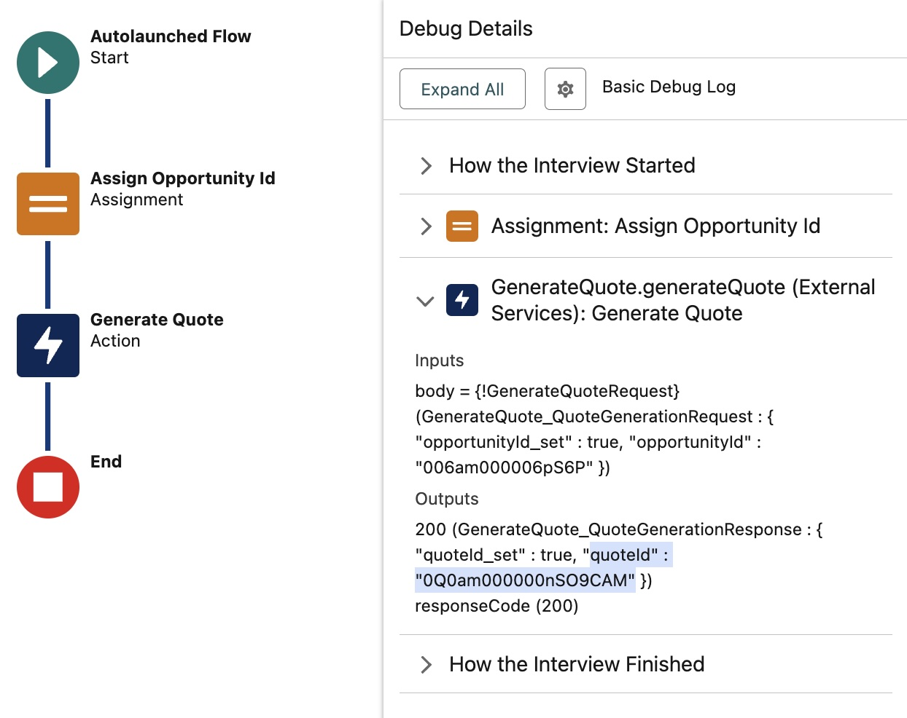

# Heroku AppLink - Extending Apex, Flow and Agentforce - Node.js

This sample demonstrates importing a Heroku application into an org to enable Apex, Flow, and Agentforce to call out to Heroku. For Apex, both synchronous and asynchronous invocation are demonstrated, along with securely elevating Salesforce permissions for processing that requires additional object or field access.

# Architecture Overview

The scenario used in this sample illustrates a basis for performing complex compute calculations over Salesforce **Opportunity** data and storing the result back in Salesforce as a **Quote**. Calculating Quote information from Opportunities can become quite intensive, especially when large multinational businesses have complex rules that impact pricing related to region, products, and discount thresholds. It's also possible that such code already exists, and there is a desire to reuse it within a Salesforce context. In this sample, you'll learn the basics of importing Heroku applications into Salesforce orgs and calling them from **Flow**, **Apex**, and **Agentforce**.



# Requirements
- Heroku login
- Heroku CLI installed
- Heroku AppLink CLI plugin installed
- Salesforce CLI installed
- Login information for one or more Scratch, Development or Sandbox orgs
- Node.js 20.x or later

## Local Development and Testing

Code invoked from Salesforce requires specific HTTP headers to connect back to the invoking Salesforce org. Using the `invoke.sh` script supplied with this sample, it is possible to simulate requests from Salesforce with the correct headers, enabling you to develop and test locally before deploying to test from Apex, Flow, or Agentforce. This sample leverages the `sf` CLI to allow the `invoke.sh` script to access org authentication details. Run the following commands to locally authenticate, install dependencies and run the sample:

```bash
sf org login web --alias my-org
npm install
npm start
```

In a new terminal window run the following command substituting `006am000006pS6P` for a valid **Opportunity Id** record from your Salesforce org, ensuring you identify an **Opportunity** that also has related **Product** line items.

```bash
./bin/invoke.sh my-org '{"opportunityId": "006am000006pS6P"}'
```

You should see the following output:

```
Response from server:
{"quoteId":"0Q0am000000nRLdCAM"}
```

You can now also view the **Quote** by refreshing the **Opportunity** page within Salesforce.

## Deploying and Testing from Apex and Flow

To test from Apex, Flow and other tools within your Salesforce org you must deploy the code and import it into your org. The following commands create a Heroku application and configure the Heroku Integration add-on. This add-on and associated buildpack allows secure authenticated access from within your code and visibility of your code from Apex, Flow and Agentforce. After this configuration, code is not accessible from the public internet, only from within an authorized Salesforce org.

Next install and configure the Heroku Integration add-on:

```
heroku create
heroku addons:create heroku-applink
heroku buildpacks:add --index=1 heroku/heroku-applink-service-mesh
heroku buildpacks:add heroku/nodejs
heroku config:set HEROKU_APP_ID="$(heroku apps:info --json | jq -r '.app.id')"
git push heroku main
heroku salesforce:connect my-org
heroku salesforce:publish api-docs.yaml --client-name GenerateQuote --connection-name my-org --authorization-connected-app-name GenerateQuoteConnectedApp --authorization-permission-set-name GenerateQuotePermissions
```

Once imported grant permissions to users to invoke your code using the following `sf` command:

```bash
sf org assign permset --name GenerateQuote -o my-org
sf org assign permset --name GenerateQuotePermissions -o my-org
```

Confirm it has started:

```bash
heroku logs --tail
```

Navigate to your orgs **Setup** menu and search for **Heroku** then click **Apps** to confirm your application has been imported.

### Invoking from Apex

Now that you have imported your Heroku application. The following shows an Apex code execution that demonstrates how to invoke your code in an synchronous manner (waits for response). Make sure to change the **Opportunity Id** `006am000006pS6P` in the `./src-apex/GenerateQuote.apex` file to a valid **Opportunity** from your org (see above).

```
sf apex run < ./src-apex/GenerateQuote.apex
```

The Apex code looks like this:

```
HerokuAppLink.GenerateQuote service = new HerokuAppLink.GenerateQuote();
HerokuAppLink.GenerateQuote.generateQuote_Request request = new HerokuAppLink.GenerateQuote.generateQuote_Request();
HerokuAppLink.GenerateQuote_QuoteGenerationRequest body = new HerokuAppLink.GenerateQuote_QuoteGenerationRequest();
body.opportunityId = '006SB00000DItEfYAL';
request.body = body;
System.debug('Quote Id: ' + service.generateQuote(request).Code200.quoteId);
```

Inspect the debug log output sent to to the console and you should see the generated Quote ID output as follows:

```
07:56:11.212 (3213672014)|USER_DEBUG|[1]|DEBUG|Quote Id: 0Q0am000000nRS5CAM
```

### Invoking from Flow

Salesforce Flow is the primary no code automation tool within Salesforce orgs and is regularly used to automate business tasks related to Accounts, Opportunities, and more. Flow builders, like Apex developers, can also benefit from additional compute power provided through your Heroku applications. There is no additional work required to enable Flow Builder to see your code-simply search for it using the Action element, as shown below.



To test invoking your code from Flow, deploy a simple Flow using the command below:

```bash
sf project deploy start --metadata Flow -o my-org
```

Open the Flow called **Generate Quote Test** and click the **Debug** button entering a valid **Opportunity Id**. Once the Flow completes inspect the contents of the output variable and you should see the now familiar **Quote Id** present. 



The Flow used here is a very basic Autolaunched Flow, however you can use this approach in other Flow types such as Screen Flows as well - allowing you to build user experiences around your Heroku applications with Flow for example.

## Permissions and Permission Elevation (Optional Advanced Topic)

Authenticated connections passed to your code are created with the user identity of the user that directly or indirectly causes a given Apex, Flow, or Agentforce operation to invoke your code. As such, in contrast to Apex, your code always accesses org data in the more secure User mode (only the permissions granted to the user), not System mode (access to all data). This favors the more secure coding convention of the principle of least privilege. If your code needs to access or manipulate information not visible to the user, you must use the approach described here to elevate permissions.

For this part of the sample we expand the code logic to detect a discount override field that only sales leaders would have access to. This field completely overrides the discount calculations for some opportunity product lines. Since by design not all users should have access to this field, in order to allow only the code to access this field it is necessary to configure elevated permissions. Run the command below to deploy a new custom field on the `OpportunityLineItem` called `DiscountOverride__c`. 

```bash
sf project deploy start --metadata CustomObject:OpportunityLineItem -o my-org
```

First let's understand the behavior without elevated permissions when the code tries to access this field with only the permissions of the user. Create a `.env` file in the root of the project with the following contents and then rerun the application locally using `npm start` as described earlier.

```
ENABLE_DISCOUNT_OVERRIDES=True
```

Use the `invoke.sh` script to attempt to generate a new **Quote**. The request will fail with a `503` and you will see in the console output the following error:

```
No such column 'DiscountOverride__c' on entity 'OpportunityLineItem'. If you are attempting to use a custom field, be sure to append the '__c' after the custom field name. Please reference your WSDL or the describe call for the appropriate names.'
```

Replicate this situation with your deployed code, by enabling discount overrides using `heroku config:set ENABLE_DISCOUNT_OVERRIDES=True`. Retry with the Apex invocation example above while monitoring the Heroku logs using `heroku logs --tail`. Once again in the Heroku debug logs you will see the above error. This is because your user does not have access to the `DiscountOverride__c` field - as per our scenario, this is a valid use case.

In order to elevate just the permissions of your code to access this field and not that of the user, an additional **Permission Set** is needed. This Permission Set contains only additional permissions the code needs - in this case access to the `DiscountOverride__c` field. The following command deploys an update to a permission set called `GenerateQuotePermissions` that contains this permission. Note this permission set, was created by the above `publish` command and is defined as requiring session activation to be active, this temporary activation is handled by the Heorku AppLink add-on for you. However, it must still be assigned to applicable users.

```bash
sf project deploy start --metadata PermissionSet -o my-org
sf org assign permset --name GenerateQuotePermissions -o my-org
```

Now that it has been updated, the **Heroku AppLink** add-on uses it to adds it to the users own permissions while executing the code - hence permissions are now elevated. To test this rerun the code using Apex invocation examples above and you should now find that a **Quote** has been successfully created as evident from the console output per the example below.

```
07:56:11.212 (3213672014)|USER_DEBUG|[1]|DEBUG|Quote Id: 0Q0am000000nRS5CAM
```

When running developing and testing locally the `invoke.sh` can take a third argument to emulate the above deployed behavior.

> [!NOTE]
> Your developer user needs permissions to assign session based permission sets required by the `invoke.sh` script. Before running the above command assign this permission using `sf org assign permset --name GenerateQuoteDeveloper -o my-org`. You need only run it once. 

```bash
./bin/invoke.sh my-org '{"opportunityId": "006am000006pS6P"}' GenerateQuoteAuthorization
```

The above `invoke.sh` now outputs additional information confirming the elevation:

```
Activating session-based permission set: GenerateQuoteAuthorization...
Session-based permission set activated. Activation ID: 5Paam00000O6m16CAB
Response from server:
{"quoteId":"0Q0am000000nSZRCA2"}
Deactivating session-based permission set: GenerateQuoteAuthorization...
Session-based permission set deactivated successfully.
```

## Invoking from Agentforce

Consult the more in-depth Heroku and Agentforce Tutorial [here](https://github.com/heroku-examples/heroku-agentforce-tutorial). 

## Technical Information
- The `api.js` file contains OpenAPI schemea extensions that tie the deployed operation to the speciic connected app and permission set names specified when running the `salesforce:publish` command shown above.
- The pricing engine logic is implemented in the `pricingEngine.js` source file, under the `src/server/services` directory. It demonstrates how to query and insert records into Salesforce.
- The `api-docs.yaml` file is automatically generated by Fastify's OpenAPI plugin. You can access the latest version at `http://localhost:8080/docs/yaml` when running locally.
- This Node.js implementation uses synchronous invocation through the AppLink SDK.
- The [@heroku/salesforce-sdk-nodejs](https://www.npmjs.com/package/@heroku/salesforce-sdk-nodejs) package is used to simplify API communications with the org. The connection is initialized by decoding information within the `x-client-context` HTTP header.
- The SDK provides a Unit of Work pattern that significantly simplifies managing related records across different objects in a single transaction. Instead of making multiple API calls and managing dependencies manually, you can:
  - Register multiple create/update/delete operations in memory
  - Define relationships between new records using references
  - Commit all changes in a single transaction
  - Get all results in a single response
  - Automatically handle rollbacks if any operation fails
  This is especially valuable when creating related records (like Quotes and Quote Line Items) where you need to maintain referential integrity.
- Source code for configuration/metadata deployed to Salesforce can be found in the `/src-org` directory.
- Requests in this type of Heroku application are being managed by a web process that implements a strict timeout as described [here](https://devcenter.heroku.com/articles/request-timeout) you will see errors in the Apex debug logs only. If you are hitting this limit consult the [Scaling Batch Jobs with Heroku - Node.js](https://github.com/heroku-examples/heroku-integration-pattern-org-job-nodejs) sample.
- Per the **Heroku Integration** add-on documentation and steps above, the service mesh buildpack must be installed to enable authenticated connections to be intercepted and be passed through to your code.

## Other Samples

| Sample | What it covers? |
| ------ | --------------- |
| [Salesforce API Access - Node.js](https://github.com/heroku-examples/heroku-integration-pattern-api-access-nodejs) | This sample application showcases how to extend a Heroku web application by integrating it with Salesforce APIs, enabling seamless data exchange and automation across multiple connected Salesforce orgs. It also includes a demonstration of the Salesforce Bulk API, which is optimized for handling large data volumes efficiently. |
| [Extending Apex, Flow and Agentforce - Node.js](https://github.com/heroku-examples/heroku-integration-pattern-org-action-nodejs) | This sample demonstrates importing a Heroku application into an org to enable Apex, Flow, and Agentforce to call out to Heroku. For Apex, both synchronous and asynchronous invocation are demonstrated, along with securely elevating Salesforce permissions for processing that requires additional object or field access. |
| [Scaling Batch Jobs with Heroku - Node.js](https://github.com/heroku-examples/heroku-integration-pattern-org-job-nodejs) | This sample seamlessly delegates the processing of large amounts of data with significant compute requirements to Heroku Worker processes. It also demonstrates the use of the Unit of Work aspect of the SDK for easier utilization of the Salesforce Composite APIs. |
| [Using Eventing to drive Automation and Communication - Node.js](https://github.com/heroku-examples/heroku-integration-pattern-eventing-nodejs) | This sample extends the batch job sample by adding the ability to use eventing to start the work and notify users once it completes using Custom Notifications. These notifications are sent to the user's desktop or mobile device running Salesforce Mobile. Flow is used in this sample to demonstrate how processing can be handed off to low-code tools such as Flow. |
